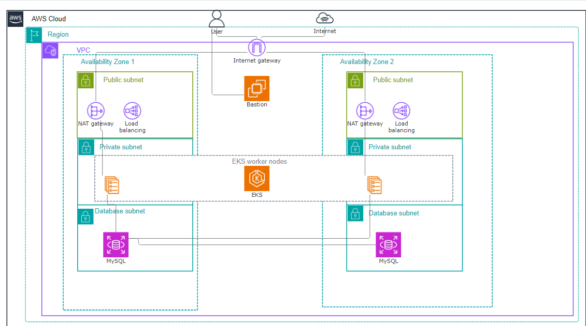

# Three tier architecture with AWS EKS

This project was built as a test assignment using Terraform and Kubernetes in AWS.

## Overview of the architecture

### Tier 1: Public subnets in VPC

The first tier consists of two public subnets, both in separate availability zones.

Public subnets host the gateways and load balancers to provide a secure way of handling the traffic.

Public subnets are exposed to the internet, meaning the rest of the tiers (EKS cluster, database) are secured from the external access.

### Tier 2: EKS cluster

EKS cluster includes the application instances and cluster worker nodes. They are hosted in two private subnets.

The cluster can be accessed via bastion EC2 host which is located in a separate public subnet. The cluster is not accessible to the public, only by admins and developers.

The EKS cluster acts as a platform to scale and deploy containerized applications with Kubernetes. The worker nodes are responsible for the application workloads and helping with scalability.

### Tier 3: Database

The database instance is a RDS instance with MySQL database engine. It stores the data for the application and is located in a separate private subnet.

The access for the database subnets is restricted. The database can be accessed only by the application instances from tier 2 or via bastion host.

The separate subnet is essential to add an additional layer of security.

### Bastion host

Only authorized users can access the bastion host in the separate public subnet. It is a secure gateway to access EKS cluster and database. Therefore we avoid the direct access to tier 2 and tier 3.

This is a secure way to allow controlled access to the cluster and database. Also, logging access activities is possible to monitor all actions.

In conclusion, the EKS cluster and worker nodes are located in tier 2 in private subnets to provide an additional level of security. Although it is a more secure way, then some more thorough configuration is needed to reach the security. Public subnets and its resources are serving as entry points to handle user traffic.

## Additional details to consider

* Multi-AZ deployments are essential to provide high availability. This comes with a result of higher infrastructure costs. It is actually one of the best practices in production environments.

* The database instance is located in a separate private subnet. This approach increases security. The database is not exposed to the public internet and is less vulnerable by potential threats. Although the database is accessible via bastion host, then some access management is needed for sure to ensure that only authorized users are accessing.

* Bastion host is a secure way of accessing resources in private subnets. It is more secure than to provide a direct access to EKS cluster or database. With correct access management it is a good way of managing the resources.